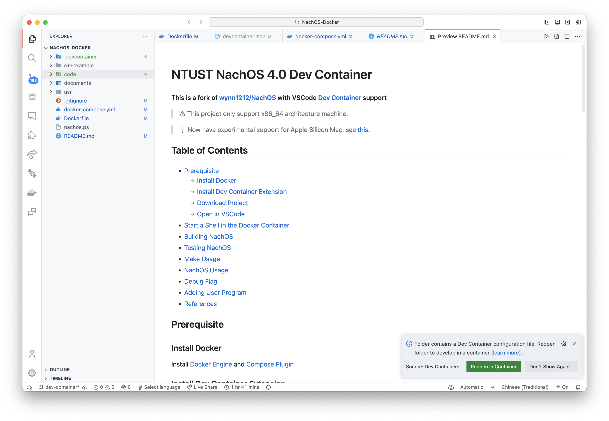
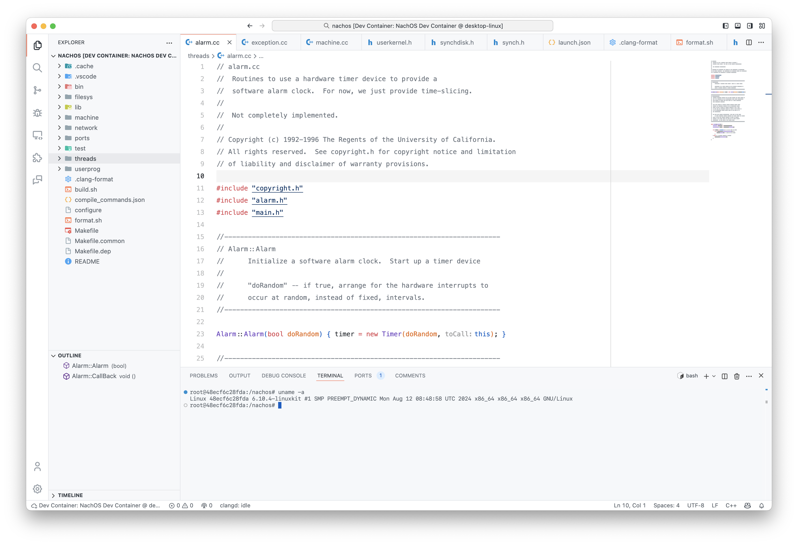
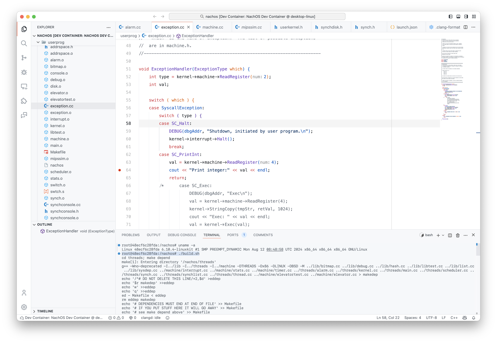
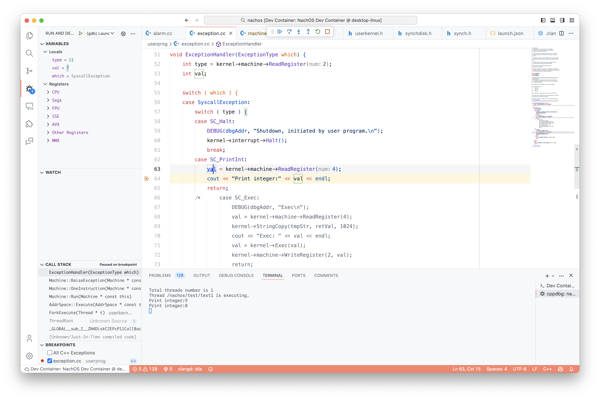

# NTUST NachOS 4.0 Dev Container

**This is a fork of [wynn1212/NachOS](https://github.com/wynn1212/NachOS) with VSCode [Dev Container](https://code.visualstudio.com/docs/devcontainers/containers) support**

📦 Out-of-the-box fully configured NTUST NachOS 4.0 development environment

> ⚠️ This project only support x86_64 architecture machine.

> 💡 Now have experimental support for Apple Silicon Mac, see [this](./documents/Apple_Silicon_Mac.md).

## Table of Contents

- [Prerequisite](#Prerequisite)
  - [Install Docker](#Install-Docker)
  - [Install Dev Container Extension](#Install-Dev-Container-Extension)
  - [Download Project](#Download-Project)
  - [Open in VSCode](#Open-in-VSCode)
- [Start a Shell in the Container](#Start-a-Shell-in-the-Container)
- [Building NachOS](#Building-NachOS)
- [Testing NachOS](#Testing-NachOS)
- [Debugging NachOS in VSCode](#Debugging-NachOS-in-VSCode)
- [Format Code](#Format-Code)
- [Make Usage](#Make-Usage)
- [NachOS Usage](#NachOS-Usage)
- [Debug Flag](#Debug-Flag)
- [Adding User Program](#Adding-User-Program)
- [References](#References)

## Prerequisite

### Install Docker

Install [Docker Engine](https://docs.docker.com/engine/install/) and [Compose Plugin](https://docs.docker.com/compose/install/linux/)

### Install Dev Container Extension

Install [Dev Container](https://marketplace.visualstudio.com/items?itemName=ms-vscode-remote.remote-containers) Extension in VSCode

### Download Project

Clone the project repository and switch to `dev-container` branch.

```shell
git clone -b dev-container https://github.com/hayd1n/NachOS-Docker
```

### Open in VSCode

Open the project in VSCode and click the `Reopen in Container` button in the bottom right corner.



## Start a Shell in the Container

After opening the project in VSCode, you can start a shell in the container by clicking the `Terminal` menu and selecting `New Terminal`.



## Building NachOS

Since this project uses clangd for syntax hints, it is recommended to use `bear` with `make` to get the correct syntax hints when compiling. You can do this automatically by running `build.sh`.

```shell
./build.sh
```

**Note 1:** Whenever you make modifications to the source code, it is essential to rebuild the entire NachOS system.

**Note 2:** If your modifications are limited to the test directory, you can simply execute `make` within the test directory to build your program. However, if you have made changes to system calls or other core components, it is still necessary to rebuild the complete NachOS system.



## Testing NachOS

After a successful build, you should find the `nachos` executable in the `/nachos/userprog/` directory and your `test1` program in the `/nachos/test/` directory.

To run `test1` in NachOS, execute the following command:

```shell
./userprog/nachos -e ./test/test1
```

_Please note that you should be inside the `nachos` directory. Otherwise, you should specify the actual location accordingly._

If you see this output, it indicates that you have successfully run `test1` in NachOS.

```
root@48ecf6c28fda:/nachos# ./userprog/nachos -e ./test/test1
Total threads number is 1
Thread ./test/test1 is executing.
Print integer:9
Print integer:8
Print integer:7
Print integer:6
return value:0
No threads ready or runnable, and no pending interrupts.
Assuming the program completed.
Machine halting!

Ticks: total 200, idle 66, system 40, user 94
Disk I/O: reads 0, writes 0
Console I/O: reads 0, writes 0
Paging: faults 0
Network I/O: packets received 0, sent 0
```

## Debugging NachOS in VSCode

To debug NachOS in VSCode, you can use the `Debug` menu. There has been a template configuration created for you in the [.vscode/launch.json](./code/.vscode/launch.json) file. You can use this configuration to debug NachOS in VSCode.

```json
{
  "version": "0.2.0",
  "configurations": [
    {
      "name": "(gdb) Launch",
      "type": "cppdbg",
      "request": "launch",
      "program": "${workspaceFolder}/userprog/nachos",
      "args": [""],
      "stopAtEntry": false,
      "cwd": "${workspaceFolder}",
      "environment": [],
      "externalConsole": false,
      "MIMode": "gdb",
      "setupCommands": [
        {
          "description": "enable gdb beautiful display",
          "text": "-enable-pretty-printing",
          "ignoreFailures": true
        }
      ]
    }
  ]
}
```



## Format Code

To format the code, you can use the `Format Document` command in VSCode. The `clang-format` tool is used to format the code according to the `.clang-format` file in the project root directory.
Otherwise, you can run the following command to format all code in the project in the terminal:

```shell
./format.sh
```

## Make Usage

See [documents/Make_Usage.md](documents/Make_Usage.md)

## NachOS Usage

See [documents/NachOS_Usage.md](documents/NachOS_Usage.md)

## Debug Flag

See [documents/Debug_Flag.md](documents/Debug_Flag.md)

## Adding User Program

See [documents/Adding_User_Program.md](documents/Adding_User_Program.md)

## References

- https://github.com/wynn1212/NachOS - NTUST modified NachOS 4.0 source code and documents.
- https://homes.cs.washington.edu/~tom/nachos/ - Original NachOS 4.0 source code and documents.
- [GitHub - connlabtw/NachOS2020](https://github.com/connlabtw/NachOS2020) - This repository originated as a fork and includes the `PrintInt()` system call implementation.
- https://blog.csdn.net/Aloneingchild/article/details/115339992 - A guide that provides a solution for building NachOS on 64-bit Linux systems.
- [GitHub - Yan-Hau/NachOS](https://github.com/Yan-Hau/NachOS/tree/master#readme) - Another solution for building NachOS on 64-bit Linux systems. This repository includes information about the required dependency packages for NachOS.
  - If you want to run NachOS on Docker or WSL2, you can follow the provided guide.
  - If you're interested in learning how to use gdb (GNU Debugger) with Visual Studio Code for NachOS development, there's also a guide available.
  - **Please be aware that this repository uses NachOS 4.1, which has a different source code structure compared to our NachOS 4.0. Additionally, it does not have the `PrintInt()` system call implemented, which means you'll need to implement the `PrintInt()` system call yourself if you choose to use this version.**

> Made with ❤️ by [Hayden](https://github.com/hayd1n)
