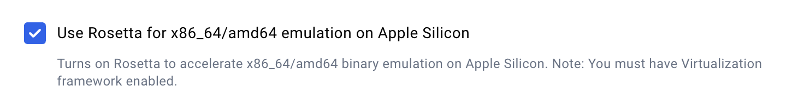
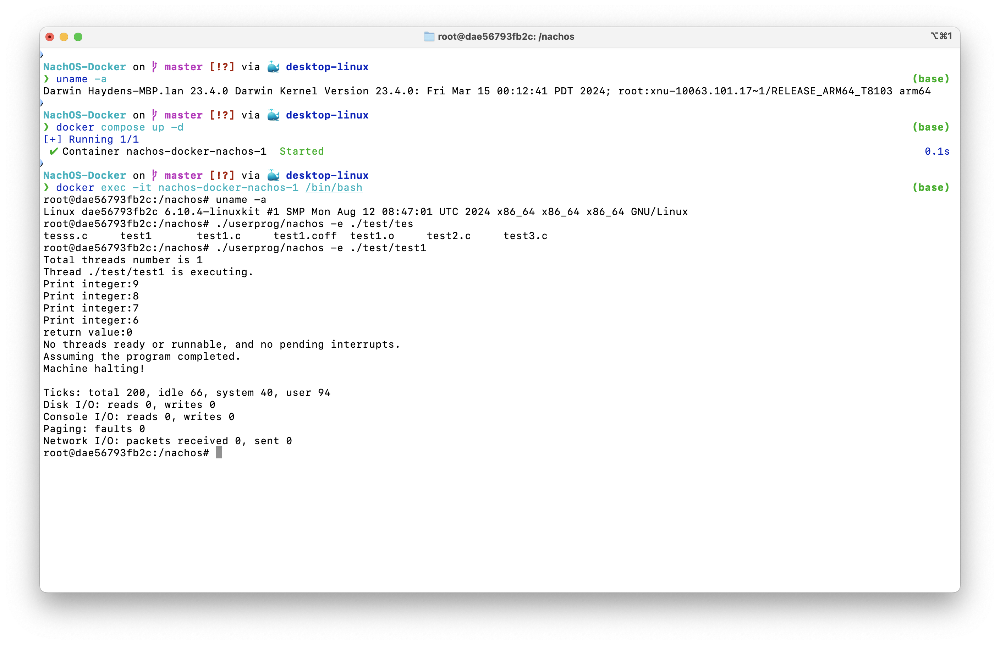

# Running on Apple Silicon Mac

This project now have experimental support for Apple Silicon Mac (M1, M2, M3, etc...) using x86_64 emulation.

**You don't need to do anything extra**, just follow the instructions in the [README](/README.md).

However, it is recommended to follow these settings.

## Enable Rosetta 2

Make sure Rosetta 2 is enabled in Docker Desktop to accelerate the x86_64 emulation.

## Test Result

Tested on M1 MacBook Pro running macOS Sonoma 14.4.1 with Docker Desktop 4.34.0 (165256).

